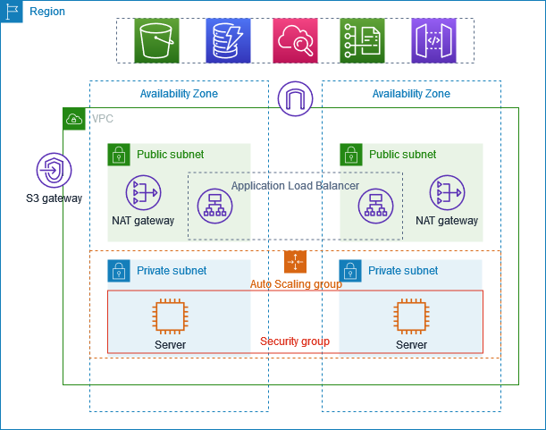

# 🌍 AWS WebApp Automated – Terraform + Ansible

## 📌 Overview

This project demonstrates a **DevOps pipeline** that fully automates the deployment of a **React portfolio website** on AWS.

It follows **Infrastructure-as-Code (IaC)** + **Configuration Management** best practices:

* **Terraform** provisions AWS infrastructure (networking, security, compute, scaling).
* **Ansible** configures EC2 instances and deploys the React app.
* **Application Load Balancer (ALB)** ensures high availability and traffic distribution.
* **Auto Scaling Group (ASG)** automatically replaces failed instances and scales based on demand.

With this setup, terminating an instance or scaling up simply triggers automation, and every new instance self-configures and serves the portfolio app.

---

## 🏗️ Project Architecture

### High-Level Flow

```
Terraform  →  AWS Infrastructure  →  Ansible  →  App Deployment
```

### Components

* **VPC** with private & public subnets across multiple AZs
* **Bastion Host** for secure SSH into private instances
* **NAT Gateway** for outbound access from private subnets
* **ASG + Launch Template** for EC2 lifecycle management
* **ALB** exposing portfolio to the internet
* **IAM Roles** with least-privilege access for EC2 & SSM
* **Ansible Playbooks** installing Node.js, Nginx, cloning repo, building & deploying app

---

## 📂 Repository Structure

```
aws-webapp-automated/
├── infra/          # Terraform IaC for AWS resources
├── ansible/        # Ansible playbooks, roles, configs
└── README.md       # Project overview (this file)
```

* **infra/** → Defines the AWS cloud infra (VPC, subnets, bastion, ASG, ALB, IAM, SGs).
* **ansible/** → Provisions EC2s inside ASG (Node.js, Nginx, swap, app build + deploy).
* **README.md** → This overview, guiding the full DevOps workflow.

---

## 🚀 Setup Flow

### 1️⃣ Provision Infrastructure (Terraform)

```bash
cd infra/
terraform init    
terraform plan -out plan.out
terraform apply "plan.out"
```

Outputs include:

* `alb_dns_name` → Public URL to access portfolio
* `bastion_public_ip` → SSH entry point
* `private_subnet_ids / public_subnet_ids`

### 2️⃣ Configure & Deploy App (Ansible)

```bash
cd ../ansible/
ansible-inventory -i inventories/aws_ec2.yml --graph   # Verify inventory
ansible-playbook -i inventories/aws_ec2.yml site.yml -vv  # Deploy app
```

Now open your **ALB DNS name** in the browser → ✅ Portfolio app live!

---

## 🖼️ Architecture Diagram



---

## 🌟 Key Features

* **IaC + Config Management** → Terraform + Ansible in a single workflow.
* **Highly Available** → ASG + ALB ensure zero downtime during instance replacement.
* **Dynamic Inventory** → Ansible auto-discovers new EC2s created by ASG.
* **Secure Access** → Bastion host with SSH ProxyCommand.
* **Scalable App Deployment** → Every new EC2 gets app auto-installed.

---

## 🐞 Troubleshooting

* **Terraform apply fails** → Check IAM permissions or Elastic IP quota.
* **Ansible inventory empty** → Verify instance tags (`Name=web_asg_instance`).
* **Portfolio app missing after ASG replacement** → Ensure latest **cloud-init.sh** or rerun **Ansible playbook**.
* **Nginx errors** → Validate with `nginx -t` on instance.

---

## 🔮 Future Improvements

* ✅ Add **SSL/TLS (HTTPS)** with ACM + ALB
* ✅ Implement **CI/CD pipeline** with GitHub Actions (Terraform + Ansible automation)
* ✅ Modularize Terraform (VPC, ASG, ALB modules)
* ✅ Add **Monitoring & Alerts** (CloudWatch + SNS)
* ✅ Add **Blue-Green / Canary Deployments** for zero downtime

---

## 🎯 Learning Outcomes

By completing this project, you will understand:

* How to design a **production-grade AWS architecture**
* Using **Terraform** for repeatable infrastructure automation
* Using **Ansible** for consistent app deployment across multiple instances
* Orchestrating **Bastion, ALB, ASG** in real-world cloud setups
* The **DevOps workflow** from infra → config → app

---

✨ Congratulations — you’ve built a **self-healing, automated deployment pipeline** for your React portfolio app!

---
