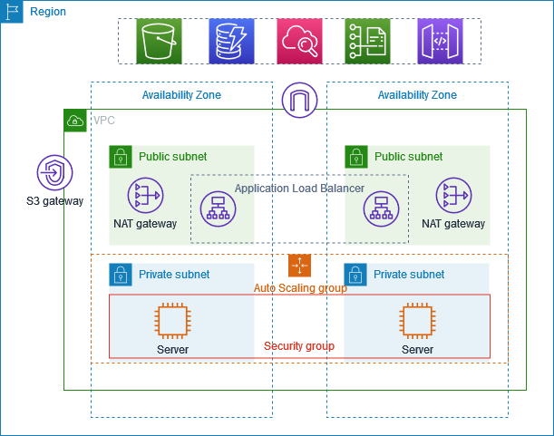

# 📘 Terraform Infrastructure – AWS WebApp Automated

## 📌 Project Description

This Terraform project provisions the **AWS infrastructure** required to host a production-ready React portfolio website.
It automates the creation of a secure, scalable, and highly available environment using AWS best practices.

### 🔧 What this project creates:

* **VPC** with 2 Public + 2 Private Subnets (across 2 AZs for HA).
* **Internet Gateway + NAT Gateway** for secure outbound internet access.
* **Bastion Host (Jump Box)** in public subnet for secure SSH access.
* **Auto Scaling Group (ASG)** with EC2 instances running the React app.
* **Application Load Balancer (ALB)** distributing traffic across ASG instances.
* **IAM Roles & Policies** for EC2 + SSM.
* **Security Groups** for controlled inbound/outbound access.

---

## 🏗️ Architecture Diagram



---

## 📋 Prerequisites

Before running this project, ensure you have:

* [Terraform CLI](https://developer.hashicorp.com/terraform/downloads) installed
* An **AWS account** with programmatic access (Access Key + Secret Key)
* [AWS CLI](https://docs.aws.amazon.com/cli/latest/userguide/getting-started-install.html) installed & configured
* **Remote backend** set up (recommended):
  
  * **S3 bucket** for storing Terraform state
  * **DynamoDB table** for state locking
  * **For setting up Remode Backend** refer to my [terraform-projects repo](https://github.com/uzair-codes/terraform-projects/tree/main) 
---

## 🚀 How to Use

Follow these steps:

```bash
# 1️⃣ Initialize Terraform
terraform init

# 2️⃣ Review execution plan
terraform plan -out plan.out

# 3️⃣ Apply changes (provision infra)
terraform apply "plan.out"

# 4️⃣ Destroy infra (when cleaning up)
terraform destroy
```

---

## 📤 Outputs Explained

After a successful run, Terraform will output:

* **alb_dns_name** → The public DNS of the Application Load Balancer (use to access the app).
* **bastion_public_ip** → SSH into the Bastion Host for secure access to private instances.
* **private_subnet_ids / public_subnet_ids** → Useful for debugging & extending infra.
* **asg_name** → The Auto Scaling Group name managing EC2 instances.

---

## 🐞 Troubleshooting

Common issues you may encounter:

* **Elastic IP quota exceeded** → NAT Gateway requires an Elastic IP, request quota increase from AWS.
* **IAM permission errors** → Ensure your AWS user has `AdministratorAccess` or required IAM policies.
* **Backend config errors** → Check your `backend.tf` file for correct S3 bucket and DynamoDB table names.
* **State lock issues** → Run `terraform force-unlock <LOCK_ID>` if DynamoDB didn’t release a lock properly.

---

## 🎯 Learning Outcomes

By working with this project, you will learn:

* How to design & provision a **highly available VPC architecture** in AWS.
* Managing **state remotely** with S3 & DynamoDB.
* Using **Terraform modules** and resources effectively.
* Infrastructure-as-Code (IaC) best practices for **repeatable deployments**.

---

✨ With this infrastructure in place, you can now move to the **Ansible configuration** to deploy your React portfolio app on top of it.

---
